# Review-Fix Loop Flow Diagram

This diagram illustrates the execution flow of `review-fix.sh`.

```mermaid
flowchart TD
    Start([Start Script]) --> Help{Help flag?}
    Help -->|--help/-h| ShowHelp[Display Help Text]
    ShowHelp --> Exit1([Exit])

    Help -->|No| ValidateEnv[Validate Environment]
    ValidateEnv --> CheckMaxLoops{MAX_LOOPS<br/>valid integer?}
    CheckMaxLoops -->|No| Error1[Error: Invalid MAX_LOOPS]
    Error1 --> Exit2([Exit 1])

    CheckMaxLoops -->|Yes| CheckCodex{Codex CLI<br/>installed?}
    CheckCodex -->|No| Error2[Error: Codex not found]
    Error2 --> Exit3([Exit 1])

    CheckCodex -->|Yes| CheckPreset{Uncommitted<br/>preset?}
    CheckPreset -->|Yes| SetFlag[Set RUNNING_UNCOMMITTED_PRESET=true]
    SetFlag --> StartLoop

    CheckPreset -->|No| CleanCheck{Working tree<br/>clean?}
    CleanCheck -->|No| Error3[Error: Uncommitted changes]
    Error3 --> Exit4([Exit 1])

    CleanCheck -->|Yes| StartLoop[Start Loop: i=1 to MAX_LOOPS]

    StartLoop --> LoopStart{i <= MAX_LOOPS?}
    LoopStart -->|No| MaxReached[Print: Reached MAX_LOOPS]
    MaxReached --> Exit5([Exit 0])

    LoopStart -->|Yes| StartSig[Compute start_signature]
    StartSig --> DeletedBefore[Capture deleted_before_iteration]
    DeletedBefore --> RunReview[Run Codex Review]

    RunReview --> PresetCheck{REVIEW_PRESET<br/>set?}
    PresetCheck -->|No| DefaultReview[codex exec /review]

    PresetCheck -->|Yes| PresetType{Preset type?}
    PresetType -->|1: PR/Branch| ValidateBranch{REVIEW_BASE_BRANCH<br/>set?}
    ValidateBranch -->|No| Error4[Error: Missing base branch]
    Error4 --> Exit6([Exit 1])
    ValidateBranch -->|Yes| ReviewBranch[Review against branch]

    PresetType -->|2: Uncommitted| ReviewUncommitted[Review working tree]

    PresetType -->|3: Commit| ValidateSHA{REVIEW_COMMIT_SHA<br/>set?}
    ValidateSHA -->|No| Error5[Error: Missing commit SHA]
    Error5 --> Exit7([Exit 1])
    ValidateSHA -->|Yes| ReviewCommit[Review specific commit]

    PresetType -->|4: Custom| ValidateInstructions{Custom instructions<br/>provided?}
    ValidateInstructions -->|No| Error6[Error: Missing instructions]
    Error6 --> Exit8([Exit 1])
    ValidateInstructions -->|Yes| ReviewCustom[Review with custom instructions]

    DefaultReview --> CaptureSession
    ReviewBranch --> CaptureSession
    ReviewUncommitted --> CaptureSession
    ReviewCommit --> CaptureSession
    ReviewCustom --> CaptureSession

    CaptureSession[Capture Session ID] --> SessionCheck{Session ID<br/>captured?}
    SessionCheck -->|No| Error7[Error: Failed to capture session]
    Error7 --> Exit9([Exit 1])

    SessionCheck -->|Yes| ApplyFixes[Apply Codex Fixes<br/>Resume session with fixes prompt]
    ApplyFixes --> EndSig[Compute end_signature]
    EndSig --> DeletedAfter[Capture deleted_after_iteration]

    DeletedAfter --> CompareSignatures{Signatures<br/>match?}
    CompareSignatures -->|Yes| NoChanges[Print: No changes detected]
    NoChanges --> Exit10([Exit 0])

    CompareSignatures -->|No| CheckDeletions[Check for deleted files]
    CheckDeletions --> DeletedFiles{Files deleted<br/>by Codex?}

    DeletedFiles -->|Yes| AutoApprove{AUTO_APPROVE_DELETIONS<br/>= true?}
    AutoApprove -->|Yes| AcceptDeletions[Auto-accept deletions]
    AutoApprove -->|No| PromptUser[Prompt user for approval]

    PromptUser --> UserResponse{User<br/>approves?}
    UserResponse -->|No| RestoreFiles[Restore deleted files from HEAD]
    UserResponse -->|Yes| AcceptDeletions

    DeletedFiles -->|No| AcceptDeletions
    RestoreFiles --> CheckUncommittedPreset
    AcceptDeletions --> CheckUncommittedPreset

    CheckUncommittedPreset{Uncommitted<br/>preset?}
    CheckUncommittedPreset -->|Yes| WarnNoCommit[Print: No auto-commit for uncommitted preset]
    WarnNoCommit --> Exit11([Exit 0])

    CheckUncommittedPreset -->|No| StageFiles{INCLUDE_UNTRACKED<br/>= true?}
    StageFiles -->|Yes| StageAll[git add -A]
    StageFiles -->|No| StageTracked[git add -u]

    StageAll --> CheckUntracked
    StageTracked --> CheckUntracked[Check for untracked files]

    CheckUntracked --> UntrackedWarning{Untracked files<br/>exist?}
    UntrackedWarning -->|Yes & not included| WarnUntracked[Warn about untracked files]
    UntrackedWarning -->|No| CheckStaged
    WarnUntracked --> CheckStaged

    CheckStaged{Staged changes<br/>exist?}
    CheckStaged -->|No| NoStaged[Print: No staged changes]
    NoStaged --> Exit12([Exit 0])

    CheckStaged -->|Yes| GenerateMsg[Generate AI commit message]
    GenerateMsg --> ResolveMsg[Resolve commit message template]
    ResolveMsg --> MsgPrecedence{Message<br/>source?}

    MsgPrecedence -->|AUTOFIX_COMMIT_MESSAGE| UseEnv[Use env variable template]
    MsgPrecedence -->|COMMIT_RULES_DOC| ParseDoc[Parse autofix_commit_message from doc]
    MsgPrecedence -->|Default| UseDefault[Use default template]

    UseEnv --> FormatMsg
    ParseDoc --> FormatMsg
    UseDefault --> FormatMsg[Format with iteration number and AI summary]

    FormatMsg --> Commit[git commit]
    Commit --> Increment[i++]
    Increment --> LoopStart

    style Start fill:#90EE90
    style Exit1 fill:#FFB6C1
    style Exit2 fill:#FFB6C1
    style Exit3 fill:#FFB6C1
    style Exit4 fill:#FFB6C1
    style Exit5 fill:#87CEEB
    style Exit6 fill:#FFB6C1
    style Exit7 fill:#FFB6C1
    style Exit8 fill:#FFB6C1
    style Exit9 fill:#FFB6C1
    style Exit10 fill:#90EE90
    style Exit11 fill:#87CEEB
    style Exit12 fill:#87CEEB
    style Error1 fill:#FF6B6B
    style Error2 fill:#FF6B6B
    style Error3 fill:#FF6B6B
    style Error4 fill:#FF6B6B
    style Error5 fill:#FF6B6B
    style Error6 fill:#FF6B6B
    style Error7 fill:#FF6B6B
```

## Legend

- **Green exits**: Successful completion (no more issues to fix)
- **Red exits**: Error conditions (validation failures)
- **Blue exits**: Loop limit reached or preset-specific exits
- **Diamonds**: Decision points
- **Rectangles**: Process steps

## Key Flow Points

### 1. Initialization
- Validates environment (MAX_LOOPS, Codex CLI)
- Checks working tree cleanliness (unless uncommitted preset)

### 2. Main Loop (1 to MAX_LOOPS)
Each iteration:
1. Computes diff signature before changes
2. Runs Codex review with configured preset
3. Captures session ID from review output
4. Resumes session to apply fixes
5. Computes diff signature after changes

### 3. Change Detection
- Compares before/after signatures
- If identical: exits successfully (no more issues)
- If different: proceeds to commit phase

### 4. Deletion Handling
- Detects files deleted by Codex
- Prompts user for approval (unless AUTO_APPROVE_DELETIONS=true)
- Restores files if user declines

### 5. Commit Phase
- Stages files (all with -A or tracked with -u)
- Generates AI commit message from diff
- Resolves final message using template precedence
- Creates commit and continues loop

### 6. Exit Conditions
- **Success**: No changes detected (Codex found no issues)
- **Completion**: Uncommitted preset completed review
- **Limit**: MAX_LOOPS reached
- **Error**: Validation failures, missing Codex CLI, dirty worktree
